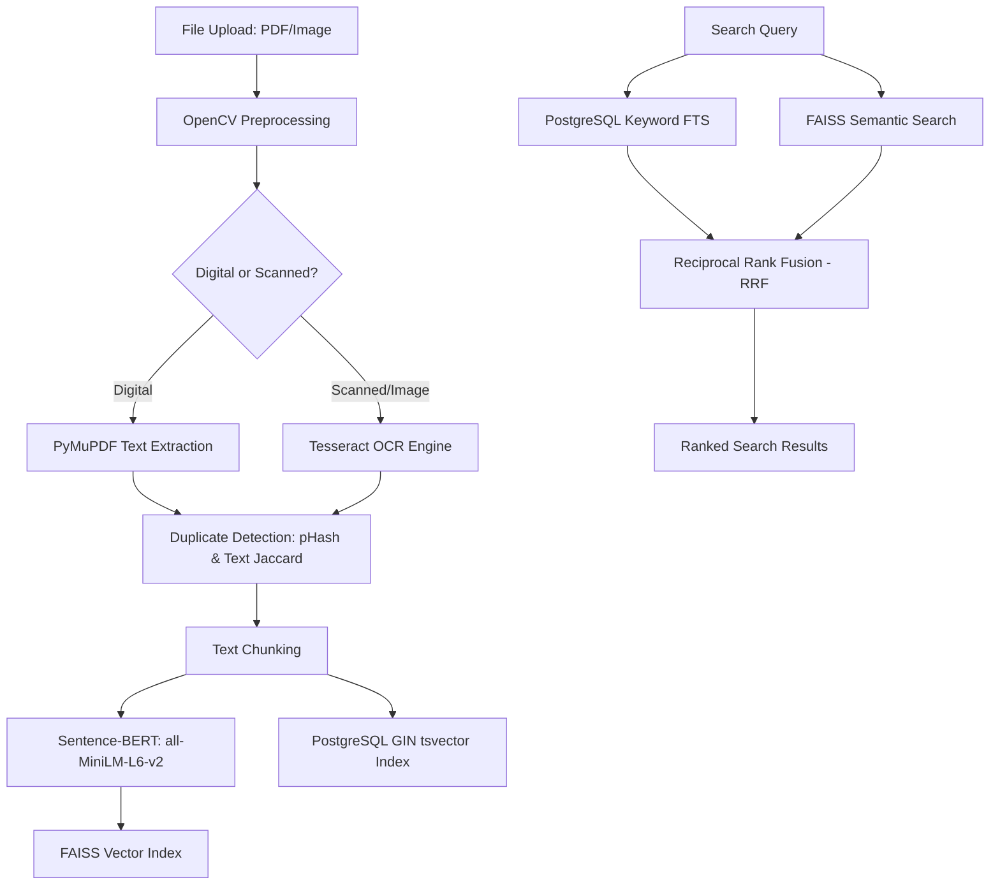

# UniArchive: Presentation & Defense Guide

This guide is designed to prepare you for your final project presentation and lecturer defense. It exhaustively details what **UniArchive** is, the computer science principles and mathematical algorithms under the hood, the technologies used, and the academic defense strategy (explaining why a custom indexing/retrieval pipeline is used instead of a generic LLM).

---

## 1. Project Overview (What is UniArchive?)

**UniArchive** is an intelligent, high-performance academic document repository and retrieval platform. It is built to resolve the challenges universities face with unorganized, unindexed study materials (digitized lecture notes, handwritten scans, past exams, and tutorials). 

### The Problem it Solves
1. **Dark Data**: Up to 80% of student study guides are scanned PDFs or images that standard database engines cannot read or search.
2. **Inefficient Search**: Standard database queries rely on exact keyword matches. If a student searches for "relational database design" but a document contains "3NF schema normalization," a traditional database will return zero results.
3. **Redundancy**: Students frequently upload identical or slightly altered files, leading to storage bloat and clutter.
4. **LLM Limitations**: Relying solely on large language models (LLMs) to query files is slow, extremely expensive, violates data privacy, and causes "hallucinations."

### The UniArchive Solution
UniArchive implements a **custom, localized retrieval pipeline** that ingest documents, extracts their text using OCR and preprocessing, indexes them semantically and lexically, detects duplicates automatically, and retrieves documents using **Hybrid Search (Reciprocal Rank Fusion)**. A lightweight, optional AI module sits on top to generate summaries and revision questions.

---

## 2. The Core Architecture & Data Pipeline

The pipeline operates in three distinct phases:

### Phase A: Document Ingestion, Image Preprocessing & OCR
1. **Intelligent Router**: When a file is uploaded, the system parses the file type and content. Digital PDFs are parsed immediately using **PyMuPDF (fitz)**, which extracts native text streams rapidly.
2. **OpenCV Preprocessing Pipeline**: Scanned documents or images undergo pre-processing to increase OCR confidence:
   * **Grayscale Conversion**: Eliminates color noise.
   * **Gaussian Denoising**: Smooths pixel artifacts.
   * **Otsu's Thresholding (Binarization)**: Converts the image into binary black-and-white pixels, isolating text contours.
   * **Deskewing**: Calculates text line skew angles and rotates the image to prevent misread characters.
3. **Tesseract OCR**: Extracts text from the optimized binary image, outputting character streams alongside an OCR confidence rating.

### Phase B: Text Chunking & Dense Embeddings
1. **Text Chunking**: Raw extracted text is split into overlapping chunks (e.g. 500 characters with 100-character overlaps) to preserve contextual boundaries.
2. **Sentence-Transformers (`all-MiniLM-L6-v2`)**: Chunks are processed by a pre-trained SBERT model. The model transforms natural language sentences into **384-dimensional dense vectors** (embeddings) representing their semantic coordinates.
3. **FAISS (Facebook AI Similarity Search) Indexing**: Embeddings are indexed dynamically in a FAISS index on CPU. An auxiliary database table `embeddings` maps each `faiss_id` to its parent `document_id`.

### Phase C: Dual-Engine Retrieval (Hybrid Search via RRF)
Instead of relying on keyword matching or semantic searching alone, UniArchive blends them using **Reciprocal Rank Fusion (RRF)**:
1. **Keyword Search**: Performs Full-Text Search (FTS) in PostgreSQL using standard English stemmers, stopwords, and a **GIN (Generalized Inverted Index)** on a generated `search_vector` column. It returns matching records ranked by **`ts_rank`**.
2. **Semantic Search**: Encodes the query into a 384-dimensional vector, searches the FAISS index for the $K$-nearest vectors using L2 distance, and returns matching documents ranked by semantic similarity.
3. **Rank Fusion**: Combines the rank positions of the documents from both search lists. The math formula is:
   $$\text{RRF Score}(d) = \sum_{m \in M} \frac{1}{k + r_m(d)}$$
   * Where $M$ is the set of search modes (Keyword and Semantic).
   * $r_m(d)$ is the rank position of document $d$ in search mode $m$ (1-indexed).
   * $k$ is a constant (standardized at **60** to prevent any single engine from dominating the ranking).
   * The document with the highest RRF Score is returned first.

### Phase D: Duplicate Detection (Visual and Textual)
To prevent duplicate uploads:
1. **Visual Hashing (pHash)**: Computes a **Perceptual Hash** of the document cover or page. Unlike cryptographic hashes (like SHA-256) which change completely if a single byte changes, `pHash` yields identical or near-identical hashes if two files look the same. We calculate the Hamming distance; if the distance is below the threshold, they are visually identical.
2. **Text Jaccard Similarity**: Calculates the Jaccard index between character $n$-gram sets of the extracted texts:
     $$J(A, B) = \frac{|A \cap B|}{|A \cup B|}$$
     If similarity exceeds `0.85`, a duplicate warning is flagged in the database.

---

## 3. Technology Stack & Design Rationale

| Layer | Technology | Why Chosen? (Design Rationale) |
| :--- | :--- | :--- |
| **Frontend** | React v19, TypeScript, Vite, CSS | Vite provides instant hot-reloads during development. Custom vanilla CSS ensures zero bloating and optimal layout flexibility. TypeScript guarantees frontend type-safety. |
| **Backend** | FastAPI, Python 3.9+ | FastAPI is asynchronous, automatically generates OpenAPI docs, and has sub-millisecond response overhead. |
| **Database** | PostgreSQL v16 | Excellent relational capability, transaction safety, and native full-text search indices (GIN/tsvector) matching search engines. |
| **Vector Search** | FAISS (CPU-bound) | Incredibly fast dense vector indexing on CPU. Eliminates the need for external vector databases (like Pinecone) or dedicated GPU servers, keeping deployment costs at zero. |
| **Embeddings** | SBERT (`all-MiniLM-L6-v2`) | Compact footprint (~90MB model size) and extremely fast vectorization. Perfect for running efficiently on standard server configurations. |
| **AI Module** | Groq & Gemini (REST) | Groq (`llama-3.3-70b-versatile`) and Gemini (`gemini-1.5-flash`) APIs queried via standard `httpx`. No heavy SDKs were installed, maintaining a lightweight runtime footprint. |

---

## 4. Academic Defense: Why Custom Search Over LLM?
*This is the most common question external examiners or lecturers ask. Use these arguments to defend your technical decisions:*

### Question: "Why didn't you just feed all documents to ChatGPT or Gemini and let users ask questions?"
1. **Context Window Limitations**: Real textbooks and academic notes are hundreds of pages long. Feeding multiple books into an LLM's context window is physically limited, slow, and expensive.
2. **High Operation Cost**: LLM APIs charge per token. Querying an LLM directly for every single search request would cost hundreds of dollars monthly. UniArchive search runs locally on CPU for **zero cost**.
3. **Hallucination Mitigation**: An LLM generates text probabilistically. If asked "Is there a COMP101 syllabus?", it might invent one. UniArchive is a **grounded system**—it retrieves actual source documents stored in PostgreSQL. The AI Study Assistant only summarizes retrieved text, preventing hallucination.
4. **Search Latency**: Asking an LLM to search for a document takes seconds. UniArchive's local PostgreSQL + FAISS engine returns matching results in **under 70 milliseconds**.
5. **Exact Match Capability**: LLMs are notoriously bad at matching exact codes (like "COMP101" vs "COMP 101"). PostgreSQL's Full-Text Search handles exact word forms and string codes perfectly.

---

## 5. Script: What to Say During the Presentation
*A structured 10-minute presentation guide:*

### Slide 1: Introduction (1 Minute)
> "Good morning, members of the panel. Today, we present **UniArchive**, an Intelligent Academic Document Retrieval System. In standard university repositories, study materials are stored as flat files—rendering scans, handwritten notes, and digitized books completely unsearchable. UniArchive fixes this by creating a localized, intelligent processing and retrieval engine."

### Slide 2: The Ingestion Pipeline & OCR (2 Minutes)
> "When a file is uploaded, our backend determines whether it is a digital PDF or a scanned image. For scanned materials, we run an image processing pipeline using **OpenCV** to apply binarization, deskewing, and denoising. This increases the accuracy of **Tesseract OCR**. Extracted text is chunked and vectorized using the **Sentence-BERT** model into 384-dimensional dense embeddings."

### Slide 3: Intelligent Retrieval: Hybrid Search & RRF (3 Minutes)
> "Standard vector search often misses exact keyword queries, while keyword search misses conceptual context. UniArchive resolves this by running a **Hybrid Search Engine**. We query a PostgreSQL GIN Full-Text Index and a CPU-bound **FAISS vector index** simultaneously. We then merge their rankings using the **Reciprocal Rank Fusion (RRF)** algorithm. This produces a final re-ranked result set that balances both exact keyword precision and deep semantic meaning in under 70 milliseconds."

### Slide 4: Interactive Demo & Polish (3 Minutes)
> "Let's demonstrate the system. Notice that our user dashboards are fully synchronized with our database. As a student, I can search the library using our Hybrid Engine. On search results, the course code and document metadata render cleanly. 
> 
> When I click on a document, we can preview the original PDF dynamically via secure authenticated blob streams, or switch to the OCR text tab. We have integrated an **AI Study Assistant** using low-overhead APIs. I can generate a document summary or revision questions with interactive accordion answers instantly. 
> 
> Furthermore, if an unexpected error occurs, a global React **ErrorBoundary** isolates the failure to protect the app shell layout, ensuring the navigation sidebar and user context remain fully active."

### Slide 5: Conclusion & Q&A (1 Minute)
> "In summary, UniArchive is a cost-effective, robust, and highly-performant document engine ready for academic scaling. We are open to your questions."

---

## 6. Expected Lecturer Q&A Checklist

### Q1: "What is Reciprocal Rank Fusion (RRF), and why is the constant $K=60$?"
* **Answer**: RRF is a rank aggregation algorithm that sums the reciprocals of document rank positions from multiple search runs. The constant $K$ (usually set between 50 and 60) acts as a smoothing factor. If $K$ is too small, a document ranked 1st in one search engine will completely overwhelm a document ranked 2nd and 3rd in both engines. A value of $60$ ensures that consensus across both engines is weighted fairly.

### Q2: "Why use FAISS instead of an online database like Pinecone?"
* **Answer**: Pinecone is a cloud-based service that requires active internet connection, incurs monthly fees, and introduces network latency. **FAISS** is a lightweight, open-source library that runs locally on CPU. It is extremely fast, highly customizable, keeps user data locally on the server for privacy, and has zero operating costs.

### Q3: "How does OpenCV deskewing improve Tesseract OCR?"
* **Answer**: Tesseract OCR relies on baseline alignment to identify word boundaries. If a scanned document is rotated even by 5 degrees, Tesseract's segmentation algorithm will merge words vertically or fail to parse lines. Our OpenCV preprocessing computes the skew angle using minimum bounding rectangles around text contours and applies an affine rotation to straighten the text, increasing OCR confidence.

### Q4: "How does your duplicate detection work?"
* **Answer**: We run a two-layered check: visual and textual. Visually, we generate a **Perceptual Hash (pHash)** of the cover page image using DCT (Discrete Cosine Transform) frequency coefficients. If two cover pages have a Hamming distance of 0 to 4, they are visually identical. Textually, we compute the **Jaccard Similarity** of the extracted character sets. If either metric triggers, the upload is flagged in the database as a duplicate warning, alerting moderators.
