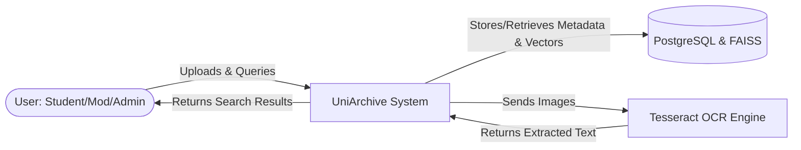
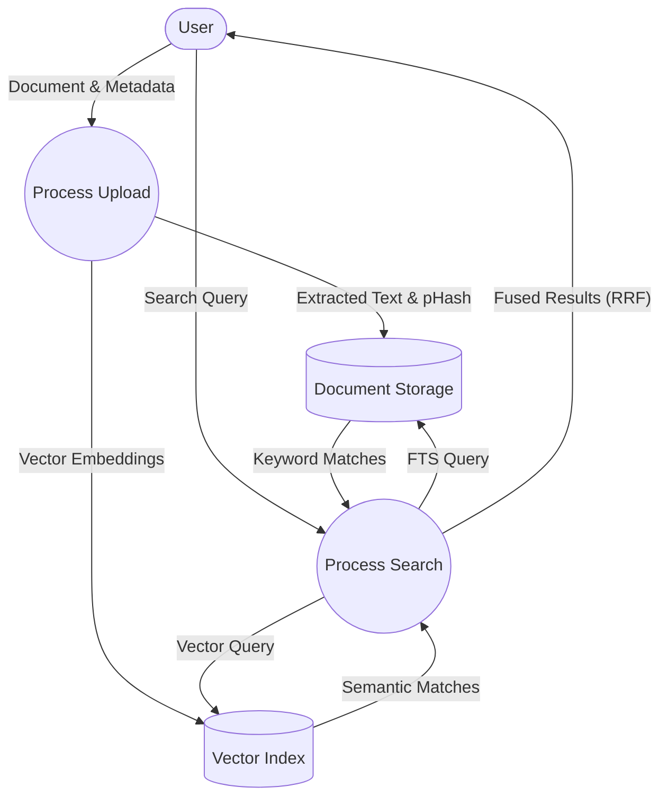
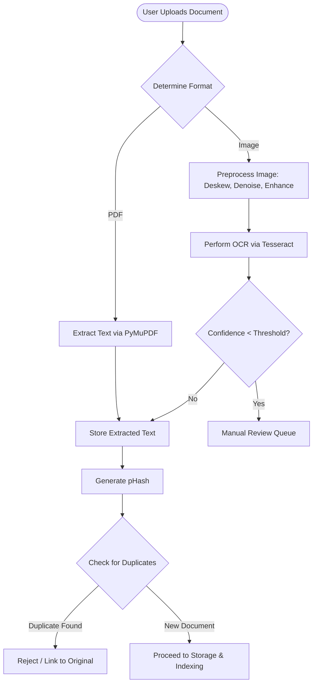
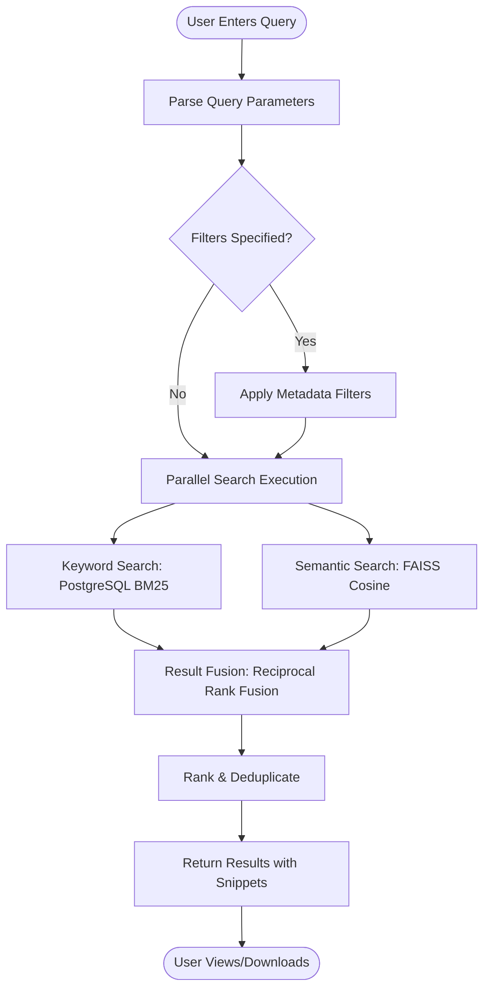

# CHAPTER 4 — SYSTEM ANALYSIS

## 4.1 Current System Analysis
Current institutional systems rely on manual tagging, leading to widespread data invisibility. UniArchive was proposed to automate this process.

### 4.1.1 Use Case Diagram
The use case diagram illustrates three actor categories interacting with UNI ARCHIVE:

**Student Actor**:
- Upload academic documents (PDF, images)
- Enter academic metadata (auto-suggested, manually confirmed)
- Search resources (keyword, semantic, or hybrid mode)
- Apply filters (Course, Year, Document Type)
- View search results with relevance snippets
- Download original documents
- Provide relevance feedback on results

**Moderator Actor** (extends Student):
- Review documents in manual OCR review queue
- Verify and correct extracted metadata
- Approve or reject pending uploads
- Manage duplicate resolution suggestions

**Administrator Actor**:
- Manage user accounts and role assignments
- Configure system parameters (OCR confidence thresholds, embedding models)
- Monitor system metrics (upload counts, search latency, OCR accuracy)
- Manage academic hierarchy (Faculties, Departments, Courses)
- Generate evaluation reports

```mermaid
usecaseDiagram
    actor Student
    actor Moderator
    actor Administrator

    Student <|-- Moderator
    Moderator <|-- Administrator

    package "UniArchive System" {
        usecase "Upload Documents" as UC1
        usecase "Search Resources" as UC2
        usecase "Apply Filters" as UC3
        usecase "Download Documents" as UC4
        usecase "Provide Feedback" as UC5
        
        usecase "Review OCR Queue" as UC6
        usecase "Verify Metadata" as UC7
        usecase "Manage Duplicates" as UC8
        
        usecase "Manage Users" as UC9
        usecase "Configure System" as UC10
        usecase "Monitor Metrics" as UC11
    }

    Student --> UC1
    Student --> UC2
    Student --> UC3
    Student --> UC4
    Student --> UC5
    
    Moderator --> UC6
    Moderator --> UC7
    Moderator --> UC8
    
    Administrator --> UC9
    Administrator --> UC10
    Administrator --> UC11
```

### 4.1.2 Context Diagram


### 4.1.3 Data Flow Diagram (DFD Level 0)


## 4.2 System Requirements

### 4.2.1 Functional Requirements
1.  **Authentication:** The system must allow users to register and log in securely.
2.  **Role Management:** The system must enforce role-based access (Student, Moderator, Admin).
3.  **Document Upload:** The system must allow users to upload PDF and image files.
4.  **Automated OCR:** The system must automatically extract text from uploaded documents.
5.  **Multi-Mode Search:** The system must allow users to search via exact keywords and semantic meaning.
6.  **Duplicate Prevention:** The system must detect and flag identical uploads.

### 4.2.2 Non-Functional Requirements
1.  **Performance:** Search queries (hybrid) must resolve in under 150 milliseconds.
2.  **Scalability:** The architecture must be decoupled to allow the backend and frontend to scale independently.
3.  **Security:** All API endpoints must be protected by stateless JWT authentication. Passwords must be hashed using bcrypt.
4.  **Reliability:** The OCR pipeline must gracefully fallback from PyMuPDF to OpenCV/Tesseract upon failure.

## 4.3 Algorithms and Workflows
The system follows a modular, pipeline-based workflow inspired by RAG architectures such as DeepTutor, adapted for deterministic retrieval without LLM components. 

### 4.3.1 OCR Workflow Algorithm
As illustrated below, the system accepts document uploads and determines processing paths based on format. Scanned documents undergo preprocessing (deskewing, denoising, contrast enhancement) before OCR processing using Tesseract. Confidence thresholding routes low-confidence extractions to manual review. Perceptual hashing detects duplicates before storage approval.



### 4.3.2 Semantic and Hybrid Search Workflow Algorithm
User queries are parsed for keywords and filters. Parallel execution performs BM25-ranked keyword search and vector similarity search. Results are fused using Reciprocal Rank Fusion or weighted scoring, deduplicated, and presented with relevance snippets and source document references.



## 4.4 Dataset Description
For analysis and testing, a controlled dataset was utilized, containing clean digital PDFs to establish baseline extraction speeds, and heavily skewed, noisy scanned images to calibrate the OpenCV thresholding algorithms to ensure the OCR pipeline met the functional requirements.
