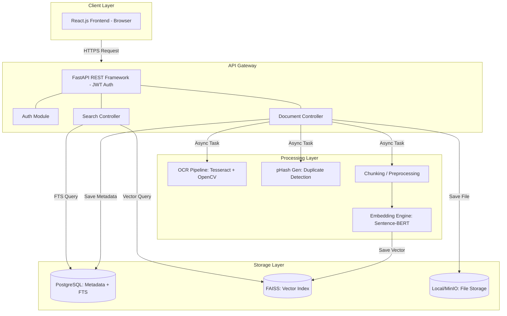
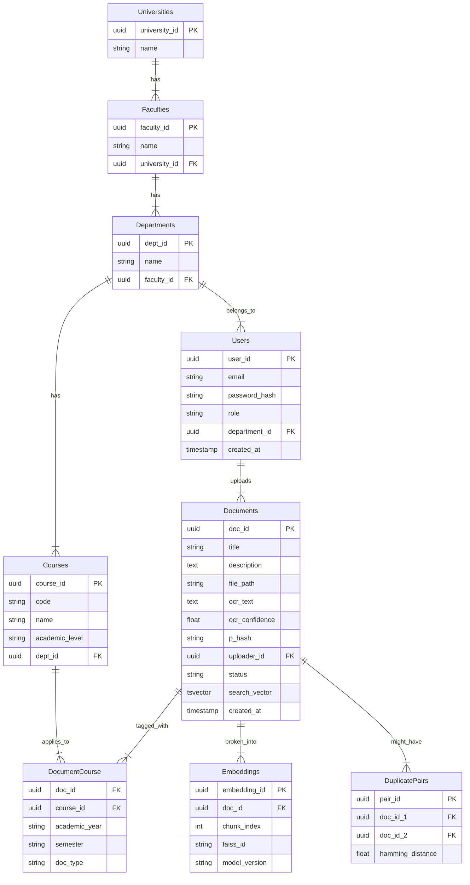

# CHAPTER 5 — SYSTEM DESIGN

## 5.1 Architectural Design
UniArchive utilizes a modern, decoupled client-server architecture to ensure high performance and scalability. The system architecture adapts RAG patterns from DeepTutor while simplifying for resource-constrained deployment.

### 5.1.1 Overall Architecture

**Key Architectural Decisions**:
- **Separation of Concerns**: Document processing (OCR, embeddings) is decoupled from serving (API) to enable asynchronous processing via a task queue.
- **Dual Storage**: Relational database for metadata and keyword search; vector index for semantic similarity.
- **Self-Contained**: No external LLM API dependencies; all processing local or self-hosted.

### 5.1.2 Backend Architecture
The backend is built in Python 3.9 using FastAPI. It exposes asynchronous RESTful endpoints. The backend architecture heavily utilizes the Singleton pattern to load the machine learning models (`all-MiniLM-L6-v2`) into memory only once during startup, preventing latency spikes during active API requests.

### 5.1.3 Frontend Architecture
The frontend is built using React 18 and Vite. It utilizes standard React Router for navigation and React Context for managing JWT authentication state. The UI communicates with the backend exclusively via REST API calls.

## 5.2 Database Design
The relational database was designed in 3rd Normal Form (3NF) to support the academic hierarchy. Relationships enforce referential integrity and enable efficient query patterns for both metadata-filtered and text-based retrieval.

### Schema Summary
*   **User**: `(user_id, email, role, department_id, created_at)` Manages RBAC and authentication credentials.
*   **academic_hierarchy**: Tables (`Universities`, `Faculties`, `Departments`, `Courses`) form a cascading relationship to tag documents contextually.
*   **Document**: `(doc_id, title, description, file_path, ocr_text, ocr_confidence, p_hash, uploader_id, status, created_at)` Stores file metadata, the extracted `ocr_text`, a `tsvector` column for full-text search, and a `phash` column for duplicate detection.
*   **DocumentCourse**: `(junction: doc_id, course_id, academic_year, semester, doc_type)`
*   **Embedding**: `(embedding_id, doc_id, chunk_index, vector_data, model_version)` Stores the relationship between a document chunk and its `faiss_id`, acting as the bridge between PostgreSQL and the FAISS vector index.
*   **duplicate_pairs**: Logs identified duplicate uploads for administrative auditing.
*   **SearchLog**: `(log_id, user_id, query_text, filters_used, results_count, timestamp)`
*   **Feedback**: `(feedback_id, user_id, doc_id, query_id, relevance_score, comments)`

## 5.3 User Interface Design

*[Insert Screenshot of Dashboard Here]*
*(Description: The main dashboard interface showing uploaded documents and system statistics)*

*[Insert Screenshot of Upload Page Here]*
*(Description: The document upload interface showing the duplicate warning alert)*

*[Insert Screenshot of Search Interface Here]*
*(Description: The search page displaying results from the Hybrid Search engine)*
