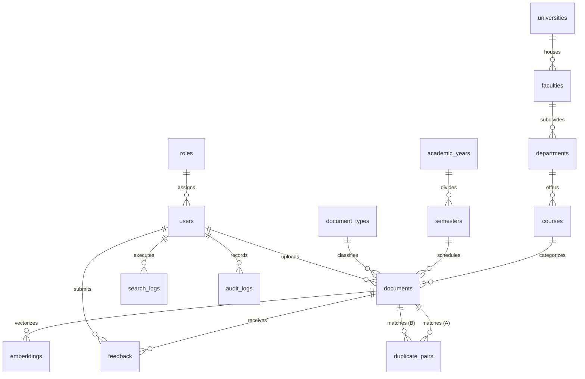

# Phase 4 — Database Design Report

**Phase:** Phase 4: Database Design  
**Status:** ✅ Complete  
**Date Completed:** June 2, 2026  
**Migration Reference:** `2f3024a667d9_initial_schema_15_tables`

---

## 1. Objectives

The objective of Phase 4 was to implement a fully normalized, relational schema in PostgreSQL designed to support:
* Strict academic hierarchy modeling.
* Role-based security tracking.
* Advanced metadata ingestion (OCR texts, perceptual hashes, embeddings).
* Operational audit logging and log analytics.
* PostgreSQL-native Full-Text Search (FTS).

---

## 2. Relational Hierarchy & ERD

The system is normalized to Third Normal Form (3NF) to eliminate reduncancy and guarantee relational integrity. The database is organized into four main layers:

* **Authentication & RBAC:** `roles` (RBAC rules), `users` (credentials and profile data).
* **Academic Structure:** `universities` -> `faculties` -> `departments` -> `courses`.
* **Document Context:** `academic_years` -> `semesters`, `document_types` (exams, CATs, etc.), and `documents` (core payload metadata).
* **Metadata & Logs:** `embeddings` (vector search blocks), `search_logs` (analytics), `feedback` (ratings), `duplicate_pairs` (perceptual hash hits), and `audit_logs` (admin trail).

### 2.1 Entity Relationship Diagram



---

## 3. Database Schema Overview

### 3.1 Primary Keys: Distributed UUIDs
All tables utilize Version 4 Universally Unique Identifiers (UUIDs) as primary keys, rather than auto-incrementing integers.
* **Benefits:** Prevents sequential enumeration attacks, facilitates database partitioning, and enables deterministic client-side generation of IDs before database transactions execute.

### 3.2 Indexing Strategy
To optimize query performance under high load, 36 indexes were generated:
* **B-tree Indexes:** Applied on foreign key columns, unique codes (e.g., department codes, course codes), and active lookup fields (`is_approved`, `status`).
* **GIN (Generalized Inverted Index):** Configured on the generated `search_vector` column inside the `documents` table to perform rapid full-text token matching.

### 3.3 PostgreSQL Full-Text Search (FTS) Integration
Rather than executing slow pattern matching queries (`LIKE '%term%'`), the document model utilizes PostgreSQL's native FTS system:
* The `search_vector` column is an automated generated column:
  ```sql
  search_vector TSVECTOR GENERATED ALWAYS AS (
      to_tsvector('english', coalesce(title, '') || ' ' || coalesce(ocr_text, ''))
  ) STORED
  ```
* This matches English language vocabulary variations (e.g. "examining" matches "exam") and scans tokens using the GIN index for quick response times.

---

## 4. Migration & Seeding Strategy

* **Versioned Evolution:** Table deployments are governed by revision script `2f3024a667d9`. Downgrades drop elements in reverse order of dependencies to avoid constraint violations.
* **Idempotent Data Seeding:** The seeding script [`seed.py`](file:///home/baragu/Documents/UniArchive/uni-archive-mvp/backend/app/db/seed.py) populates necessary lookup structures (roles, document classifications) and builds an initial demo structure (University of Nairobi courses and semesters) for testing.
* **Referential Integrity Constraints:** Foreign keys are guarded by cascade rules. For example, deleting a department cascade-deletes sub-courses and related documents, whereas deleting a user's role is restricted (`ON DELETE RESTRICT`) to prevent orphaned user records.
